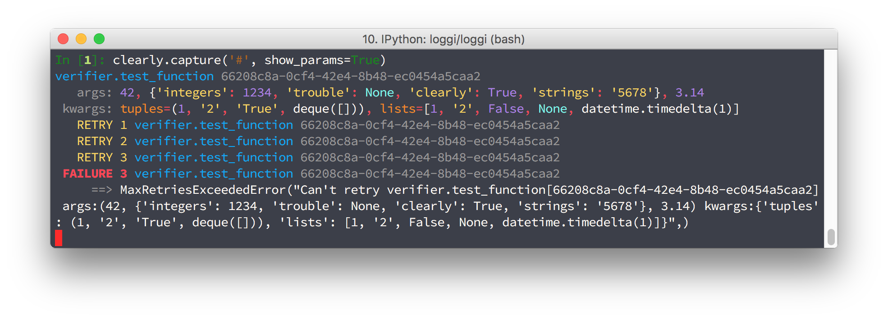
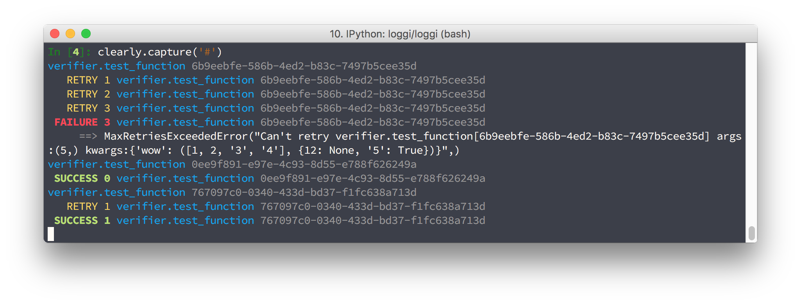
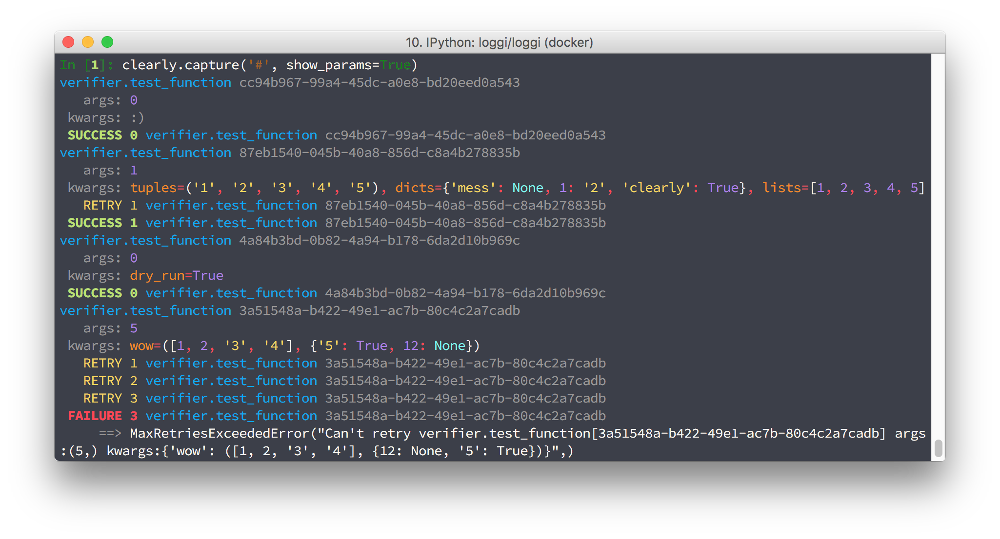
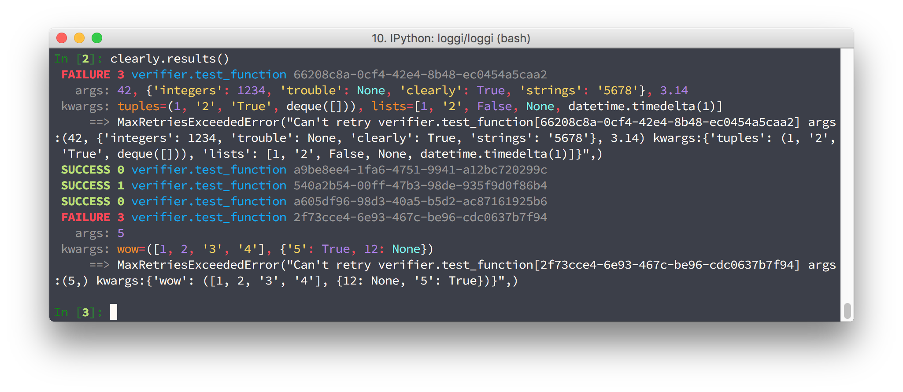

# clearly
## Simple and accurate real-time monitor for celery

I like [flower](https://github.com/mher/flower).  
But in the last couple of weeks, it's not been _that_ useful to me.  
Why is that? I'd like _actual_ real-time monitoring, filter multiple tasks at once and complete, whole, thorough, comprehensive results!  
And that other project needs page refreshes, filter only one task type at a time and truncates results... 😞

Ok, `clearly` does provide all that!  
But they're very different, `clearly` does not have a server nor persists any data nor listens for celery events, so it does not aim to substitute flower whatsoever. But it is a flower alternative nevertheless, and I do think `clearly` complements it nicely.  
It's great to actually _see_ what's going on in your celery tasks, and in real-time, so it's great for debugging.

See what `clearly` looks like:



## Requirements

You can use `clearly` if your asynchronous system with celery:
- uses a [RabbitMQ](https://www.rabbitmq.com/) broker to decouple and persist messages;
- publishes the messages to one unique exchange of type "topic";
- has a result backend configured (I've tested only with [Redis](https://redis.io/)).


## How `clearly` works

This tool creates a non durable exclusive queue in the broker, and connects itself to it, dynamically binding any routing keys you wish.

Now it begins collecting all async tasks being triggered with matching routing keys, and starts fetching what's going on with those tasks, as well as the results as soon as they finish. It's really like flower on the shell!

Please do understand that `clearly` only "sees" in real-time the messages that are being _requested_ (or published) at this very moment, not any ones that have already been published and are awaiting in a queue, as it connects to the same exchange the application does connect to. With this approach, it is guaranteed to not mess with your application logic, as `clearly` gets only a copy of the messages your application is publishing, not modifying or interfering with the process at all.


## Features

`clearly` enables you to:
- Be informed of any and all tasks being requested and run now, in real-time;
- Filter the async calls any way you want;
- Inspect the actual parameters the tasks were called with;
- See and analyze the outcome of these tasks, such as success results or fail exceptions;
- _Clearly_ see all types and representations of the parameters/outcomes of the tasks with an advanced printing system, syntax highlighting and symbols, similar to what your favorite REPL would do.


## Get `clearly`

1. `pip install -U clearly`
2. there's no step 2.


## How to use

### initialize it

```python
EXCHANGE_NAME = 'mysystem'

from project.celeryconf import app
from clearly import Clearly
clearly = Clearly(app, EXCHANGE_NAME)
```

### grab them

```python
clearly.capture('#')
```


### be amazed



### you can also grab like

```python
clearly.capture('#', show_params=True)
```


### and also be amazed



### note
Any way you capture them, `clearly` is always storing the same data about the tasks. The `show_params` is only informative, if you'd like to see them right in the capture mode. You can see them later too.


### stop capturing and analyze

(The default is to `show_error`, as it is much more likely to get your interest)

### get the big picture


## Documentation

```python
def capture(self, routing_keys,
            show_params=False, show_success=False, show_error=True):
    """Gathers all tasks being sent to celery that matches routing keys.
    You can press CTRL+C at any time to stop capturing, without losing
     anything already captured.
    
    Args:
        routing_keys (str): a string to be split into routing keys.
            use * as exactly one part or # as zero or more.
            ex.: 'dispatch.# email.#' to filter messages starting with
                  or 'dispatch.#.123456.#' to filter that exact id and pos
                  or even '#.123456.#' to filter that exact id anywhere.
        show_params (bool): if True shows params of all tasks
        show_success (bool): if True shows successful tasks' results
        show_error (bool): if True shows failed tasks' results
    """

def fetch(self, show_success=False, show_error=True):
    """Fetches results of pending captured tasks, blocking if necessary.

    Args:
        show_success (bool): if True shows successful tasks' results
        show_error (bool): if True shows failed tasks' results
    """

def pending(self, show_params=False):
    """Prints pending captured tasks.

    Args:
        show_params (bool): if True shows params of all tasks
    """

def results(self, show_success=False, show_error=True):
    """Prints captured tasks which have terminal status, specifically 
     success, failure or revoked status.
    
    Args:
        show_success (bool): if True shows successful tasks' results
        show_error (bool): if True shows failed tasks' results
    """

def reset(self):
    """Resets all captured data.
    """
```


## Hints

- write a small [celery router](http://docs.celeryproject.org/en/latest/userguide/routing.html#routers) and in there generate dynamic routing keys, based on the actual arguments of the async call in place.
That way, you'll be able to filter tasks based on any of those constraints.
- if you're using [django](https://www.djangoproject.com/) and [django-extensions](https://github.com/django-extensions/django-extensions), put in your settings a `SHELL_PLUS_POST_IMPORT` to auto import this!
Now you just have to create an instance of it and you're good to go.
- put together a python module in your project to already initialize an instance of `clearly` and configure it.
Now you have a tool always ready to be used, easily pluggable even in production, to actually see what's going on in your tasks, and figure out that pesky bug.


## To do

- support python 3 (not actually tested yet, maybe it even works);
- implement a weak reference in tasks data, to be able to keep `clearly` running live 24/7, without jeopardizing the host's memory;
- include a plugin system, to be able to print representations of custom objects;
- filter captured results even more with a regexp;
- any other ideas welcome!

## License
This software is licensed under the MIT License. See the LICENSE file in the top distribution directory for the full license text.

## Thank you.
